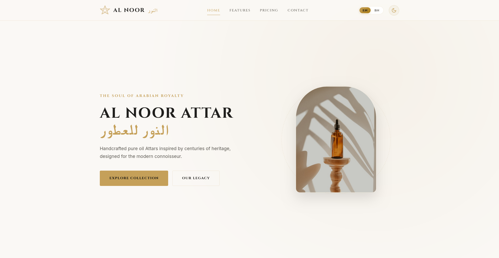
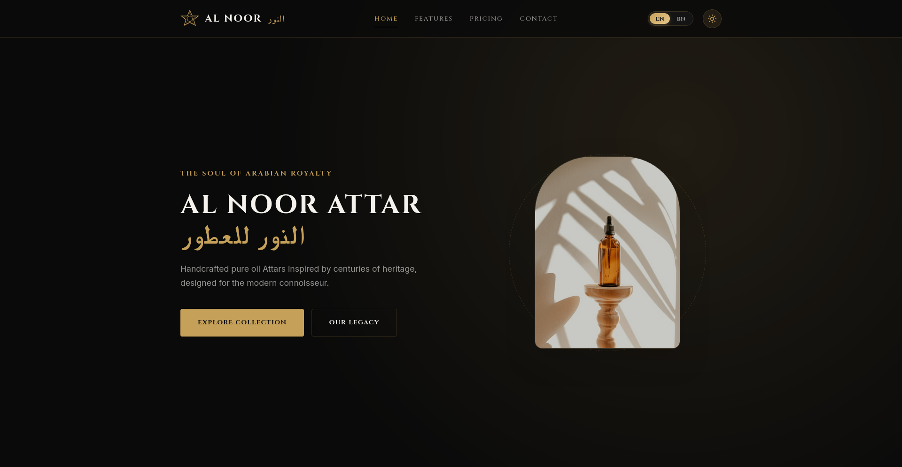
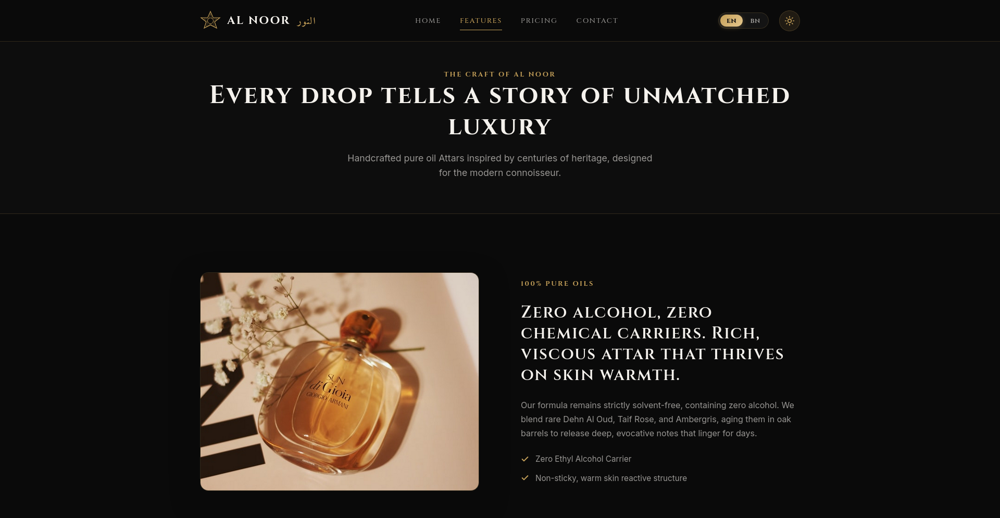
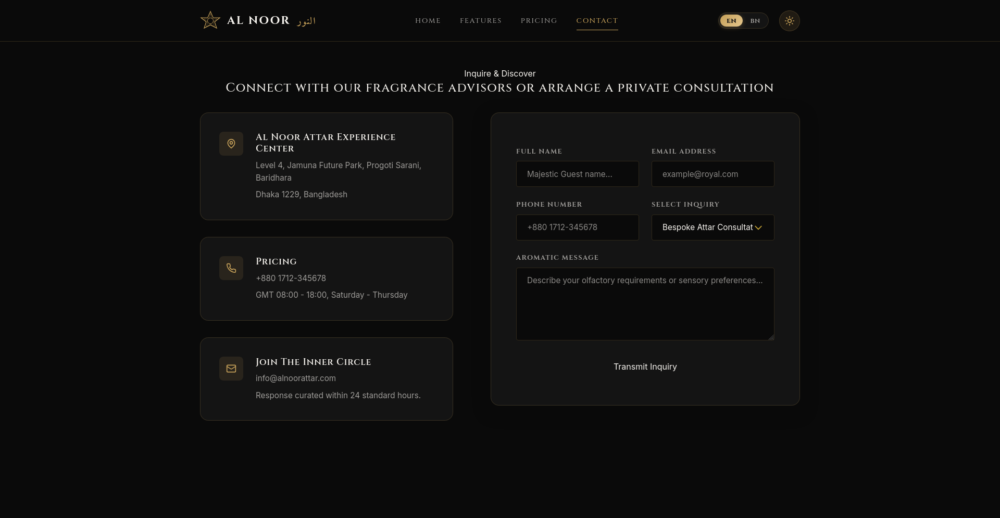
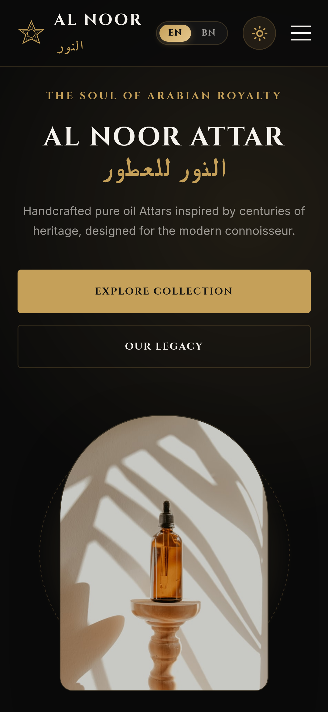

# Al Noor Attar (النور للعطور) - Luxury Arabian Fragrance Startup

Welcome to **Al Noor Attar**, a complete, production-ready luxury Arabic fragrance landing and products website designed as an elite showcase assignment. 

## 📸 Project Screenshots

### 🏠 Homepage


### 🛍️ Products Section


### ✨ Features Section


### 📞 Contact Page


### 📱 Mobile Responsive View


---

## ✨ Key Features
*   **Dual Language (EN/BN) Support**: Integrated, dependency-free localized translation system. Swap between English and Bengali dynamically. Persistent selections are stored in `localStorage`.
*   **Persistent Color Themes**: Toggle between a dark metallic "Obsidian" layout and a pristine light "Alabaster White" layout.
*   **Full Responsiveness**: Adaptive scaling meticulously crafted for mobile portrait (`480px`), mobile landscape (`768px`), tablet (`992px`), and ultra-wide monitor viewports.
*   **Dynamic Products Rendering**: Category filtering (Woody, Floral, Earthy, Bestseller) implemented in Vanilla JS, loading items asynchronously from a product database.
*   **Micro-Animations & Interaction**:
    *   *Real-time scroll progress line* centered at the top of windows.
    *   *Intersection-aware statistical counters* that count up when revealed.
    *   *Collapsible FAQ accordions* with smooth height translations.
    *   *Floating Back-To-Top trigger* with gold hovering rings.
    *   *Atelier Inquiry contact form* with status validations and transmission delays.
    *   *Sleek loading overlay* displaying abstract brand star calligraphy.

---

## 🛠️ Tech Stack & Directory Structure
*   **HTML5** (Semantic layout frames)
*   **CSS3** (Unified custom variables, custom typography, gold styling)
*   **Vanilla JS** (IntersectionObserver, LocalStorage state trackers)
*   **Vite** (To bundle, optimize, and serve multi-page assets cleanly)

```
project-root/
├── index.html
├── features.html
├── pricing.html
├── contact.html
├── 404.html
│
├── assets/
│   └── logo/
│       ├── logo-light.svg
│       └── logo-dark.svg
│
├── css/
│   ├── variables.css
│   ├── reset.css
│   ├── navbar.css
│   ├── footer.css
│   ├── home.css
│   ├── features.css
│   ├── pricing.css
│   ├── contact.css
│   ├── responsive.css
│   └── animations.css
│
├── js/
│   ├── app.js
│   ├── theme.js
│   ├── language.js
│   ├── navbar.js
│   ├── animation.js
│   ├── counter.js
│   ├── contact-form.js
│   ├── faq.js
│   ├── scroll-progress.js
│   └── back-to-top.js
│
├── data/
│   ├── products.json
│   ├── testimonials.json
│   ├── pricing.json
│   └── translations.json
│
├── docs/
│   ├── design-system.md
│   ├── deployment-guide.md
│   └── project-overview.md
│
├── .gitignore
├── README.md
└── netlify.toml
```

---

## 🚀 Running Locally
To test the website locally, compile the assets, or run a development server:

1.  **Install dependencies**:
    ```bash
    npm install
    ```
2.  **Start development server**:
    ```bash
    npm run dev
    ```
    Open `http://localhost:3000` inside your browser to view the live preview of the application.
3.  **Compile production files**:
    ```bash
    npm run build
    ```
    Vite will compile and optimize all pages, static resources, and translation modules directly into the `dist/` build directory, ready for Netlify or Vercel distributions.
